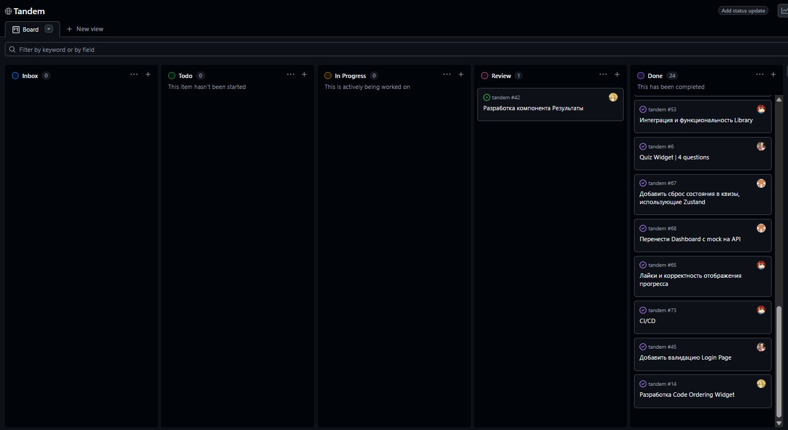

# Tandem

**Tandem | RS Trainer** — это платформа для подготовки к собеседованиям и изучения программирования. Приложение предоставляет пользователям инструменты для эффективной подготовки к техническим собеседованиям с помощью интерактивных тренажеров, таких как квизы, задачи на алгоритмы и другие виды упражнений. Включает в себя следующие типы тренажеров:

- Квиз
- Вставка кода
- Сортировка
- True / False
- Порядок кода

### Deploy - https://tandem-iota-puce.vercel.app/

Демонстрация состояний загрузки и обработки ошибок (Week #5 Checkpoint) - https://www.youtube.com/watch?v=s66y0jmoXaM

## Команда 🦄

- **[Артем](https://github.com/Artem-WebDeveloper) — Team Lead** • 👮 Chief Unicorn Officer | [Diary](./development-notes/artem-webdeveloper/)
- **[Алексей](https://github.com/AlexeyDmt) — Frontend Engineer** • 🔮 Alchemist of Languages & Validation | [Diary](./development-notes/alexeydmt/)
- **[Глеб](https://github.com/exppx) — Frontend Engineer** • 🧙‍♂️ Performance Optimization Wizard | [Diary](./development-notes/exppx/)
- **[Карина](https://github.com/Igel-k) — Backend Engineer** • 🐉 The Database Goddess | [Diary](./development-notes/Igel-k/)
- **[Кристина](https://github.com/mightyprinces) — Frontend Engineer** • 🧚‍♀️ The Fairy of UI | [Diary](./development-notes/mightyprinces/)
- **[Дарья](https://github.com/raenlin) — Best Mentor** • 🌟 The Guiding Star

## Kanban-Board

- **[GitHub Projects](https://github.com/users/Artem-WebDeveloper/projects/2/views/1)**
  

## Code Review

- **[#33 Feature/library](https://github.com/Artem-WebDeveloper/tandem/pull/33)**
- **[#62 Feat/results](https://github.com/Artem-WebDeveloper/tandem/pull/62)**
- **[#36 Feat/login page](https://github.com/Artem-WebDeveloper/tandem/pull/36)**
- **[#46 Feat/api migration](https://github.com/Artem-WebDeveloper/tandem/pull/46)**

## Meeting Notes

- [Note #1](./meeting-notes/meeting-2026-02-15.md)
- [Note #2](./meeting-notes/meeting-2026-02-21.md)
- [Note #3](./meeting-notes/meeting-2026-03-29.md)
- ...

## Структура проекта

```bash
src
│
├── app — Главный компонент приложения, в котором определяется структура и Роутинг
│
├── core
│   ├── api — API-слой
│   ├── assets — Статические ресурсы: изображения, иконки и SVG-файлы
│   ├── components — Папка для всех компонентов прриложения
│   ├── configs — Конфигурации и константы
│   ├── errors — Обработка ошибок
│   ├── feature — Модули тренажеров: логика и компоненты по типам заданий
│   ├── i18n — Интернационализация: переводы и настройка локализации
│   ├── mock — Моки для работы в Mock-mode
│   ├── store — Zustand хранилище для управления состоянием
│   ├── theme — Настройки UI-темы
│   ├── types — Общие Types и Interfaces в приложении
│   └── utils — Утилиты и хелперы
│
├── pages
│   ├── Dashboard — Страница с информацией о пользователе и его статистике
│   ├── Library — Страница с выбором квизов и тренажёров для подготовки
│   ├── Login — Страница для логина/регистрации пользователя
│   ├── NotFound — Страница, показываемая при ошибке 404
│   ├── Practice — Страница для практических заданий
│   └── Results — Страница с результатами прохождения тестов
│
├── setupTests.ts — Настройка тестового окружения
├── global.scss — Основные стили для всего приложения
└── main.tsx — Точка входа: инициализация и монтирование приложения
```

## Tech Stack

| Категория           | Технологии                           |
| ------------------- | ------------------------------------ |
| Язык                | TypeScript, React 19                 |
| UI                  | MUI 7, Emotion, Sass (SCSS)          |
| Роутинг             | React Router 7                       |
| HTTP Client         | Axios                                |
| State Management    | Zustand                              |
| Локализация         | i18n                                 |
| Визуализация        | @ant-design/plots                    |
| Drag & Drop         | @dnd-kit/react, @dnd-kit/helpers     |
| Работа с кодом в UI | react-syntax-highlighter             |
| Сборка              | Vite 7                               |
| Тесты               | Vitest, Testing Library, jsdom       |
| Качество кода       | ESLint, Prettier, lint-staged, Husky |

## Setup

```bash
# Установить зависимости:
npm install

# Запуск в режиме разработки
npm run dev
```
