**Дата:** 2026-02-18

# Quiz Single Choice (JS/TS)

---

## Задачи

- Наметить пользовательский флоу: выбор сложности, отображение вопросов, сбор ответов
- Продумать структуру запроса/ответа сервера для квиза (сервер хранит все данные + правильные ответы)

---

## Ход работы

Определение логики работы квиза:

- Вопросы рендерятся по одному
- Пользователь выбирает вариант ответа
- После завершения всех вопросов ответы отправляются на сервер
- Сервер проверяет и возвращает результаты

### Пользовательский флоу

```
Пользователь выбирает сложность (easy/medium/hard)
  → QuizFetchRequest { difficulty, quizNumber }
  → QuizFetchResponse { questions[] }
  → Пользователь отвечает на все вопросы
  → QuizSubmitRequest { answers[] }
  → QuizSubmitResponse { results[] }
  → Отображение результатов на фронте
```

### TypeScript интерфейсы

```typescript
// Вариант ответа на вопрос
interface QuizOption {
  id: number; // идентификатор варианта
  text: string; // текст варианта
}

// Вопрос + варианты ответов
interface QuizQuestion {
  id: number; // идентификатор вопроса
  question: string; // текст вопроса
  options: QuizOption[]; // варианты ответа
  type: string; // тип вопроса / квиза (Single Choice)
}

// Запрос квиза с сервера
interface QuizFetchRequest {
  difficulty: number; // 1 = easy, 2 = medium, 3 = hard
  quizNumber: number; // порядковый номер квиза в выбранной сложности
}

// Ответ сервера на запрос квиза
interface QuizFetchResponse {
  id: string; // идентификатор квиза
  section: string; // раздел / тема квиза
  type: string; // тип квиза
  difficulty: number; // сложность
  questions: QuizQuestion[]; // массив вопросов
}

// Ответ пользователя на вопрос
interface UserAnswer {
  questionId: number; // к какому вопросу относится ответ
  optionId: number; // выбранный вариант
}

// Отправка ответов на проверку
interface QuizSubmitRequest {
  quizId: string; // идентификатор квиза
  answers: UserAnswer[]; // ответы пользователя
}

// Ответ сервера с результатами квиза
interface QuizSubmitResponse {
  totalCorrect: number; // количество правильных ответов
  totalIncorrect: number; // количество неправильных ответов
}
```

---

## Вопрос

Необходимо унифицировать формат запросов и ответов между фронтом и бэком, чтобы можно было добавлять новые типы квизов и уровни сложности без переделок.

---

**Дата:** 2026-02-20

# Quiz - Унификация типов (JS/TS)

---

## Задачи

- Обсудить с командой формат запросов и ответов для всех типов квизов
- Унифицировать контракт между фронтом и бэкендом
- Финализировать общие TypeScript-интерфейсы
- Место в проекте

- Все задания будут храниться и отображаться на странице **Library**

---

## Ход работы

Сегодня в команде обсуждали унификацию запросов и ответов.

Глеб предложил структуру на основе своего квиза Code Completion.

### Пример от Глеба (Code Completion)

Ответ сервера при загрузке задания:

```json
{
  "id": "cc-001",
  "section": "Core JS",
  "type": "code-completion",
  "difficulty": 2,
  "questions": [
    {
      "id": 1,
      "code": "const result = arr.___(x => x > 0);",
      "blanks": ["___"],
      "hint": "This method returns a new array with elements that pass the test"
    }
  ]
}
```

Отправка ответов пользователя на сервер:

```json
{
  "taskId": "cc-001",
  "userAnswers": [
    { "questionId": 1, "payload": "filter" },
    { "questionId": 2, "payload": "map" }
  ]
}
```

Ответ сервера с результатами:

```json
[
  { "questionId": 1, "isCorrect": true },
  { "questionId": 2, "isCorrect": false }
]
```

---

## Итоговая архитектура типов

Предположил, что будет удобно в простых квизах унифицировать их.

Можно разделить на универсальные и кастомные(для типа задания).

---

### Универсальные типы

Используются для всех простых квизов(названы лёгкими в документации).

#### Enums

```typescript
// Пока что планируется три вида сложности
export enum Difficulty {
  Easy = 1,
  Medium = 2,
  Hard = 3,
}

// Пример типов заданий
export enum TaskType {
  SingleChoice = 'single_choice',
  MultipleChoice = 'multiple_choice',
  TrueFalse = 'true_false',
}
```

#### BaseTask — базовая информация квиза

```typescript
// Общие поля, которые есть у любого задания на сервере.
// Фронт использует поле type как discriminator — определяем, какой компонент рендерить.
export interface BaseTask {
  id: string; // уникальный идентификатор задания
  type: TaskType; // тип задания — discriminator для фронта
  difficulty: Difficulty; // уровень сложности
}
```

#### TaskListItem — мета для страницы Library

```typescript
// Отображение и фильтрация списка заданий.
export interface TaskListItem {
  id: string;
  title: string; // название квиза для отображения
  section: string; // "Core JS", "TypeScript", "Advanced JS"
  difficulty: Difficulty;
  type: TaskType;
  tags?: string[]; // Дополнительной фильтрация?
}
```

#### TaskFetchResponse — union всех возможных ответов сервера

```typescript
// Practice.tsx получает один из этих типов по discriminator type.
// Расширяется когда кто-то из команды добавляет новый квиз —
// универсальные типы при этом не трогаются.
export type TaskFetchResponse = SingleChoiceTaskResponse | TrueFalseTaskResponse;
// | another quize
```

```
GET /api/tasks/:id → TaskFetchResponse  (Practice - получение нужного квиза)
```

#### Отправка ответов на сервер

```typescript
// Ответ пользователя на один вопрос.
// payload - универсальное поле: каждый тип квиза кладёт своё значение.
// Single Choice → string (id выбранного варианта)
// True/False    → boolean
export interface UserAnswer {
  questionId: number;
  payload: unknown;
}

// Запрос на проверку ответов - одинаков для всех квизов
export interface TaskSubmitRequest {
  taskId: string;
  userAnswers: UserAnswer[];
}
```

#### Получение результатов от сервера

```typescript
// Результат по одному вопросу.
// Сервер возвращает только результат проверки — правильно или нет.
export interface QuestionResult {
  questionId: number;
  isCorrect: boolean;
}

// Итоговый ответ сервера после проверки.
// На фронте сопоставляем questionResults[] с userAnswers[]
// Можно по questionId и красить ответы.
// Процент выполнения считается на фронте:
export interface TaskSubmitResponse {
  taskId: string;
  totalQuestions: number;
  correctAnswers: number;
  questionResults: QuestionResult[];
  // score = correctAnswers / totalQuestions * 100 можно посчитать на фронте
}
```

---

## Расположение в проекте

### Общие типы

```
src/
  core/
    types/
      quiz.ts
```

### кастомные

```
src/
  features/
    singleChoice/
      types/
        index.ts
```

---

**Дата:** 2026-02-22

### Задачи

- Создать компонент SingleChoiceQuiz.tsx

### Ход работы

Создал компонент `SingleChoiceQuiz.tsx` - отображение вопросов по очереди, выбор варианта кликом, кнопка Next / Submit.
Добавил простые стили `SingleChoiceQuiz.module.scss`

Обновлены `SingleChoiceTaskResponse` и моковые данные (добавлены поля `section` и `tags`), которые ожидает header.
Т.к. получал ошибку `PracticeHeader.tsx:26 Uncaught TypeError: Cannot read properties of undefined (reading 'map')`.

### Результат

Квиз открывается по адресу `/practice/sc-001..003`

### TODO

Финальный сабмит и переход на Results.

---

**Дата:** 2026-02-24

# Quiz — Dashboard, tests (Single Choice)

---

## Задачи

- Определить состав метрик для Dashboard
- Расширить `TaskSubmitResponse`
- Сгенерировать полный набор тестов (HTML, CSS, JS, TypeScript, React)
- Определиться с финальным количество вопросов по уровням сложности

---

## Обновление Dashboard

На митинге договорились, что на дашборде должны отображаться:

- Статус прохождения (passed / not passed)
- Процент выполнения
- Система очков (score)

Вся логика расчёта и хранения — на backend.

### Обновлённый TaskSubmitResponse

```ts
export interface TaskSubmitResponse {
  taskId: string;
  totalQuestions: number;
  correctAnswers: number;
  percentage: number;
  score: number;
  questionResults: QuestionResult[];
  passed?: boolean;
}
```

## Генерация вопросов и определения их количества для разных уровней сложности

Первоначальная задумка, - 25 вопросов на каждый уровень.

В процессе работы решил подкоректировать их количество:

- Easy — 25
- Medium — 20
- Hard — 15

Итоговый score будет расти за счёт сложности, при модификаторах х1,x2,x3, вопросы уровня hard дадут всё равно больше баллов.

---

## Генерация тестов

Объём данных:

- 5 направлений (HTML, CSS, JS, TypeScript, React)
- 3 уровня сложности
- Строгий контракт фронт / бэк
- Случайный порядок правильных ответов

---

### Попытка 1 — ChatGPT

**Плюсы:**

- Корректная структура
- Правильный формат

**Проблема:**

- В ~90% случаев правильный ответ — вариант **A**

Несколько итераций не решили проблему, получал только обещание, что сейчас всё будет 'OK'

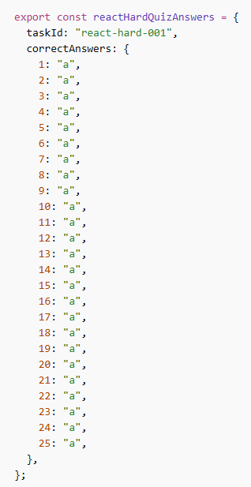

---

### Попытка 2 — Claude

- Принял большой объём (~153 страницы, ~16 950 слов)
- Сократил тесты до нужного количества

**Проблема:**

- Правильные ответы массово стали **B** или **C**
- Закончились лимиты токенов

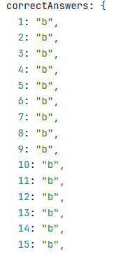
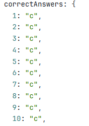

---

### Попытка 3 — Алиса

- Часто обрывала выполнение
- Требовала постоянного продолжения
- Не справилась с большим объёмом

---

### Попытка 4 — Gemini (thinking model)

Использовалась бизнес-версия.

**Плюсы:**

- После уточнений справилась
- Реально перемешала правильные ответы
- Обработала большой объём

**Минусы:**

- Понадобилось ~5 итераций
- Включил `correctAnswer` в данные для фронта
- Требовала очень точного промпта

## 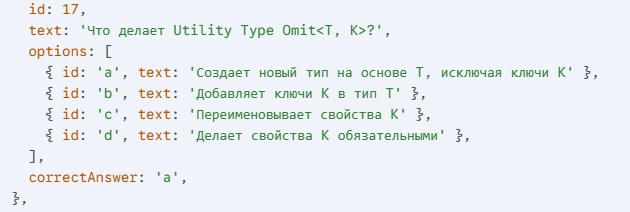

## Возврат к ChatGPT

В итоге снова вернулся к ChatGPT.

- Скормил данные (по темам)
- Просил разделить: на данные для фронта и бэка

Исправили:

- HTML
- CSS
- JS
- TypeScript

---

## Проблема с React

На этапе React закончились лимиты токенов, и пришлось переключиться на менее мощную модель.

**Результат:**

- Падение качества
- Независимо от промпта возвращались только данные для backend
- Игнорировалась часть про массив вопросов для фронта

В итоге React был окончательно доделан снова через Gemini.

---

## Итог

- Потрачено несколько часов
- Использовано 4 разных ИИ
- Много итераций и переформулировок
- Финальный набор тестов собран

### Вывод

Большие объёмы данных, строгая структура, равномерное распределения правильных ответов, -это оказались сложной задачей для ИИ бесплатных версий.

Надеюсь, что в рамках этого квиза к генерации заданий возвращаться не придётся.

---

**Дата:** 2026-02-25

# Quiz, Локализация (i18n)

В задачах GitHub есть нераспределённая задача по локализации проекта.

Решил посмотреть, насколько сложной будет эта задача в реализации.

На митинге обсуждалось использование библиотеки i18n.

Сформировалось понимание базовой архитектуры локализации проекта.

## Install

npm install i18next react-i18next

---

## How will it work?

Общий поток работы:

React Component
↓
useTranslation()
↓
i18next
↓
JSON файлы c переводом
↓
Строка в зависимости от языка

---

### Inner logic

### Structure

Magic namespaces:

- common
- quiz
- dashboard
- library
- errors

files:

src/
shared/
i18n/
index.ts
locales/
en/
common.json
quiz.json
dashboard.json
ru/
common.json
quiz.json
dashboard.json

---

#### Example

en/common.json
{
"quiz": {
"start": "Start Quiz",
"completed": "Completed",
"questions": "Questions"
}
}

ru/common.json
{
"quiz": {
"start": "Начать тест",
"completed": "Пройдено",
"questions": "Вопросы"
}
}

import { useTranslation } from 'react-i18next';

const QuizButton = () => {
const { t } = useTranslation();

return <button>{t('quiz.start')}</button>;
};

- i18next загружает переводы
- Хранит выбранный язык
- Хук useTranslation() предоставляет функцию t()
- t() возвращает строку перевода

---

## Switching lang

import i18n from "./i18n";

i18n.changeLanguage('ru');
i18n.changeLanguage('en');

-i18next обновляет внутренний state
-React перерисовывает компоненты
-t() начинает возвращать строки из ru

## Backend

### Вариант 1

Question {
id: string;
translations: {
ru: QuestionContent;
en: QuestionContent;
}
}

Определяется что показывать на фронте

{
"id": 1,
"translations": {
"ru": {
"text": "Что означает HTML?",
"options": []
},
"en": {
"text": "What does HTML mean?",
"options": []
}
}
}

### Вариант 2?

приходит с бэка только один вариант, в зависимости от выбранного в меню языка

Тогда возникает проблема при переключении языка. Необходимо перезагружать данные.
В идеале, необходимо блокировать при активном квизе.

## Storage

Где будем хранить?

- localStorage
- берём из браузера
- профиль пользователя (backend)

Предполагаемая логика:

Новый пользователь:
считываем язык браузера => рендерим нужный вариант => сменил язык? => записываем в localeStorage + бэк.

Уже Зарегистрированный пользователь логиниться => берём язык с бэка

## Features of use (пока ни разу не понятно)

Поддержка:
-pluralization
-interpolation
-lazy loading

i18next делает:

-pluralization (1 вопрос / 2 вопроса / 5 вопросов)

-interpolation ({{count}})

-форматирование дат

-lazy loading

-fallback language (язык по умолчанию, если есть проблема с загрузкой текущего)

## Change lang during quiz?

Блокировка? (Запретить смену языка во время теста + popup.)

if (isQuizInProgress) {
showWarningPopup();
return;
}

Наверное лучше вообще не давать менять язык при активном квизе. Плохой UE.

---

Необходимо, чтобы остальные разработчики тоже использовали эту библиотеку. Но необходимо первоначальная работа, которая создаст базовую структуру с примерами как это работает.

---

**Дата:** 2026-03-07

# Quiz, стилизация

Обновил стилизацию, для сохранения общего дизайна квизов

---

**Дата:** 2026-03-08

# Quiz, localization

## Установика в внедрение необходимых библиотек

- i18next
- react-i18next
- i18next-browser-languagedetector

## Предпологаемая структура

/core/i18n/locales/en
/core/i18n/locales/ru

- `common` Кнопки, хэдер, футер `locales/common.json`
- `quiz` квизы `locales/quiz.json`
- `dashboard` Статистика `locales/dashboard.json`
- `library` списки с квизами `locales/library.json`
- `auth` регистрация `locales/auth.json`
- `errors` 404 page `locales/errors.json`

## Создание и внедрение компонента(переключение языка)

`src/core/components/LanguageSwitcher/LanguageSwitcher.tsx`

## Итог

- Установлены необходимые библиотеки
- Создан `LanguageSwitcher.tsx` и добавлен в header

---

**Дата:** 2026-03-09

# Quiz, localization

### Обновлен Файл `src/core/components/LanguageSwitcher/LanguageSwitcher.tsx`

- Нормализация языка (`en-US` → `en`) для кроссбраузерности

```typescript
const langCode = i18n.language.split('-')[0] as 'ru' | 'en';
const currentLang = LANGUAGES[langCode] ? langCode : 'en';
```

Это решает проблему с разными форматами языка в Chrome (`en`) vs Firefox (`en-US`).

### Переводы

**Header/Footer/Navigation:**

- Используется namespace `common`
- Переведены: названия разделов, кнопки, копирайт

**Dashboard:**

- Используется namespace `dashboard`
- Переведены: заголовки, описания блоков статистики, названия категорий

**Проблемы:** Приложение не работало в firefox

**Решение:** Добавлена нормализация языкового кода

```typescript
const langCode = i18n.language.split('-')[0];
```

### Обновлен / завершен перевод

- Header (заголовок, описание, навигация, кнопка "Выход")
- Footer (копирайт)
- Navigation (Дашборд, Библиотека)
- Dashboard (заголовки, блоки статистики, категории)

**Упрощён код**

Убран неиспользуемый `label` из объекта `LANGUAGES`:

```typescript
const LANGUAGES = {
  ru: { flag: 'Ru' },
  en: { flag: 'En' },
};
```

### TODO

- Добавить переводы для Library (фильтры, карточки)
- Добавить переводы для Quiz UI (кнопки навигации, прогресс)
- Добавить переводы для страницы Practice

### Видео-презентация

🎥 **Feature Component Presentation:** [Localization System](https://youtu.be/7W1CqsvTDWQ)

- Работа переключателя языка
- Архитектура системы локализации
- Интеграция в компоненты
- Использование `useTranslation` hook

---

**Дата:** 2026-03-13

# Quiz, fix logic

## Решена проблема с хранением выбраных результатов при движении назад/вперед

При навигации по квизу возникала проблема с сохранением выбранных ответов.

При движении вперёд `selectedOptionId` всегда сбрасывался в `null`, даже если ответ уже был сохранён.

Убрал отдельный state для `selectedOptionId` — теперь всё берётся из массива `userAnswers`:

## Рефакторинг навигации

Упростил компонент на основе code review:

## Обработчик выбора опции

Добавлен отдельный handler для изменения выбранного варианта, всё сразу сохраняется в `userAnswers`

```typescript
const handleOptionChange = (optionId: string) => {
  setUserAnswers((prev) => {
    const updated = [...prev];
    updated[currentIndex] = {
      questionId: currentQuestion.id,
      payload: optionId,
    };
    return updated;
  });
};
```

### Итого

- Навигация работает корректно в обоих направлениях
- Выбранные ответы сохраняются корректно
- Убраны лишние проверки блдагодаря `QuizNavigation`

---

**Дата:** 2026-03-15

# Code Review: Login Page

Разбирался в реализации аутентификации и регистрации пользователей (@Igel-k)

Для работы с сервером используется axios

**Axios** — библиотека для HTTP запросов

---

Аутентификация и текущий пользователь завяза на паре **access_token** и **refresh_token**

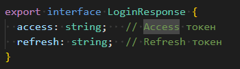

JWT-токены: Используется пара access + refresh токенов

access_token — для авторизованных запросов
refresh_token — для обновления access при истечении

Токены сохраняются в localStorage при логине и удаляются при выходе.

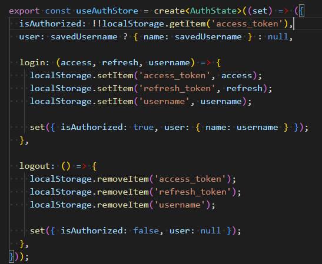

Zustand store управляет состоянием авторизации:

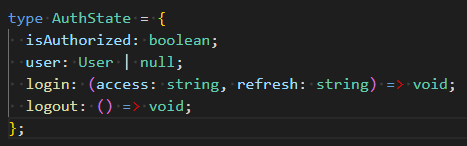

---

Регистрация(RegisterDialog.tsx):

После заполнения формы в RegisterDialog, - registerApi() отправляет запрос на сервер
При успехе — модалка закрывается, проверка login / password реализована на сервере
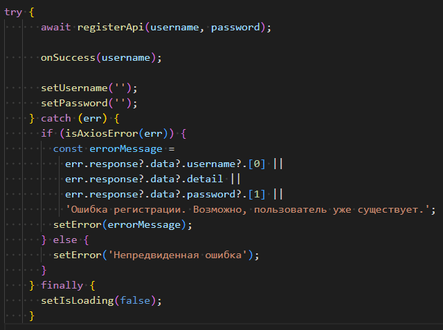

Интересное:

Ошибки отображаются через MUI Alert компонент и автоматически скрываются через 5 секунд (useEffect с таймером)

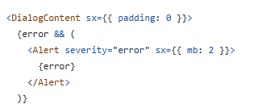
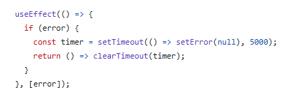

Используется isAxiosError() для типизированной обработки ошибок, которые пришли с сервера, где последовательно проверяются ошибки в login, password & detail (общие ошибки)

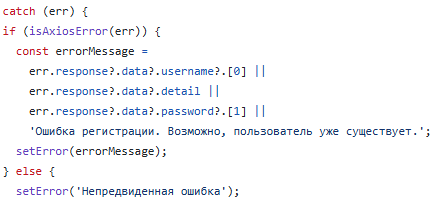

---

**Дата:** 2026-03-16

# Unit Testing

### Unit-тесты для SingleChoiceQuiz

Написано несколько базовых unit-тестов для компонента `SingleChoiceQuiz.tsx`.

**Тесты:**

1. Компонент рендерится без ошибок
2. Отображается текст вопроса 1
3. Проверка отсутствия вопросов 2 и 3
4. Отображение вариантов ответа
5. Отображение счётчика количества вопросов
6. Отображение кнопки навигации 'назад'
7. Переход на второй вопрос

Используемые инструменты: Vitest — тестовый фреймворк

**Итог**

Тесты покрывают базовый функционал и проверяют, что компонент корректно рендерится и отображает все необходимые элементы.

**Файл:** `src/core/feature/SingleChoiceWidget/SingleChoiceQuiz.test.tsx`

---

**Дата:** 2026-03-22

# Localization

На днях, добавил локализацию в проект. Получилось удачно, без критических замечаний.

Использовал i18next, react-i18next, i18next-browser-languagedetector для переведена интерфейсов основных страниц

-Header, Footer
-Dashboard
-Library
-Practice
-Login page

- Quizes

Но этим и создел себе проблемы, теперь мой квиз при смене языка сбрасывается на первый вопрос.
Хорошо, что есть решение у другого члена команды, который использует Zustand для хранения вопросов и ответов.

---

**Дата:** 2026-03-23

# update quize

Из-за внедрения локализации пришлось пересмотреть структуру квизов, теперь каждый вопрос и варианты ответов языковую версию(ru & en).

Как и прошлый раз пришлось использовать несколько ии, так как в какой-то момент они переставали понимать что от них нужно.

Потратил много времени, но в итоге цель достигнута: квизы успешно адаптированы под локализацию и отправлены на бэк.

Структура:

```json
[
  {
    "type": "single_choice",
    "difficulty": 1,
    "section": "HTML",
    "time_limit": 12,
    "title": {
      "ru": "Основы HTML",
      "en": "HTML Basics"
    },
    "description": {
      "ru": "Базовые вопросы по HTML разметке и структуре документа",
      "en": "Basic questions about HTML markup and document structure"
    },
    "tags": ["html", "easy"],
    "questions": [
      {
        "id": 1,
        "text": {
          "ru": "Какой тег является корневым для HTML документа?",
          "en": "Which tag is the root element?"
        },
        "options": [
          {
            "id": "a",
            "text": {
              "ru": "<html>",
              "en": "<html>"
            }
          },
          {
            "id": "b",
            "text": {
              "ru": "<body>",
              "en": "<body>"
            }
          },
          {
            "id": "c",
            "text": {
              "ru": "<head>",
              "en": "<head>"
            }
          },
          {
            "id": "d",
            "text": {
              "ru": "<root>",
              "en": "<root>"
            }
          }
        ],
        "correct_answer": "a"
      }
    ]
  }
]
```

---

**Дата:** 2026-03-29

## Page validation

Для того, чтобы не дергать сервер каждый раз, решили сделать часть валидации на фронте.

Перед отправкой на сервер на фронте проверяется валидность как логина, так и пароля. Есть интерактивность для показа силы пароля, что добавляет элемент соревновательности и развивает память.

Но это если пользователь его не сохранил, потому что если он его забыл, процедуру восстановления не сделали...

- Добавлена клиентская валидация логина и пароля
- Реализованы отдельные функции validateUsername и validatePassword
- Добавлен вывод ошибок под полями ввода, это место показалось наиболее подходящим.
- Введена логика touched для контроля отображения ошибок
- Реализована базовая UX-логика отображения сообщений

---

**Дата:** 2026-03-30

## Page validation again

После PR выяснилось, что я немного перемудрил, и нужно разгрузить страницу авторизации, так как она дублирует логику регистрации, и надо бы ее разгрузить.

А на митинге выяснилось, что не хватает значка, который показывал бы пароль, что являлось бы хорошим UX.

- Убрал избыточную логику валидации
- На login page теперь показываются только ошибки сервера
- Теперь можно увидеть пароль

Итог: форма стала проще, чище и ближе к реальности
