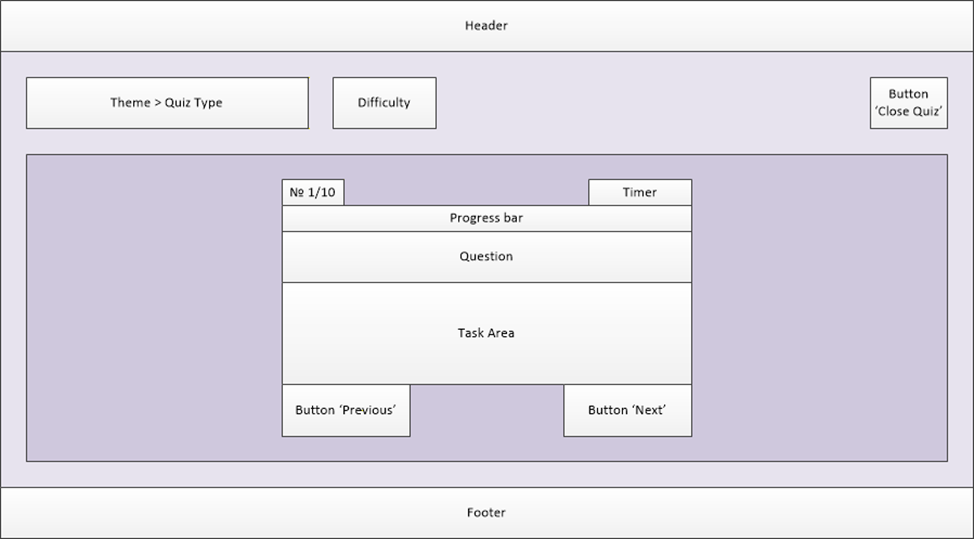
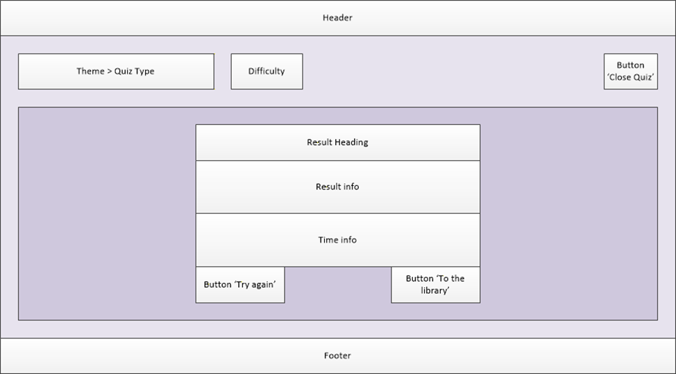

# 2026-02-16 (Code Completion Widget)

## Список задач на сегодня

- [ ] Придумать макет квиза;
- [ ] Разработать JSON-схему для информации о квизе;
- [ ] Подобрать компоненты Material UI для оформления компонента квиза.

## Ход работы

Для начала решил, что нужно дать пользователю информацию о том, какой сейчас квиз запущен и на какой сложности, а также возможность покинуть квиз. Эта информация является общей и не зависит от квиза, поэтому может быть вынесена на общую страницу (надо предложить это команде).

Для самого квиза было решено выделить следующие компоненты:

- номер вопроса вида 4/15;
- оставшееся время;
- строку прогресса (для более наглядного отображения прогресса);
- вопрос (в случае с моим квизом подсказку);
- зону задания (где будет код и поле для ввода пропуска);
- кнопки "Назад" и "Вперед" для перемещения по вопросам.

Примерный вид компонента на странице получисля таким:  


Задумался о том, что финальный экран с итогами квиза можно сделать общим компонентом (надо обсудить с командой).  
Примерный вид, думаю, должен быть таким:  


Дальше JSON-схема.
За основу возьму пример с описания задания на GitHub:

```json
{
  "id": "cc-001",
  "type": "code-completion",
  "version": 1,
  "difficulty": 2,
  "tags": ["array-methods", "filter"],
  "payload": {
    "code": "const result = arr.___(x => x > 0);",
    "blanks": ["___"],
    "hints": [
      {
        "ru": "Этот метод возвращает новый массив с элементами, прошедшими проверку",
        "en": "This method returns a new array with elements that pass the test"
      }
    ]
  }
}
```

Для начала, разобрался, зачем нужна версия (для обратной совместимости, при переходе на новый формат).  
Данный пример содержит различные варианты подсказаок для разных локалей, что в нашем слкчае не нужно, а также представляет собой всего один вопрос, я же хочу, чтобы в одном квизе было несколько вопросов (5-15 штук). А еще здесь отсутствует информация о разделе, к которому относится задание.  
По итогу пришел к выводу, что JSON-схема должна выглядеть примерно вот так:

```json
{
  "id": "cc-001",
  "section": "Core JS",
  "type": "Code Completion",
  "difficulty": 2,
  "timeLimit": 180,
  "tags": ["array-methods"],
  "version": 1,
  "questions": [
    {
      "code": "const result = arr.___(x => x > 0);",
      "blanks": ["___"],
      "hint": "This method returns a new array with elements that pass the test",
      "answer": "filter"
    }
  ]
}
```

Задумался о том, нужно ли нам где-то на странице отображать теги (их тоже можно сделать общим компонентом, так как они будут нужны, как минимум, в библиотеке квизов (предложить команде)). Думаю можно расположить где-то в районе названий раздела и квиза. Решу позже, когда накидаю более конкретный дизайн.

Осталось согласовать её с Кариной (разработчиком бекэнда).

Слышал, что в Figma можно использовать компоненты Material UI для создания дизайна. Буду пробовать разобраться, чтобы набросать более конкретный вид для квиза и, заодно, познакомлюсь с Material UI.  
Как оказалось, в бесплатной версии набор UI-китов сильно ограничен, а набор Material 3 едва ли похож на Material UI. Придется ограничиться простым сопоставлением элемент-компонент без визуального примера. Для этого пойду изучать документацию по Material UI.

Сопоставление элементов интерфейса с компонентами Material UI:

- Номер вопроса - Box;
- Таймер - Box;
- Строка прогресса - LinearProgress;
- Вопрос - Box + TipsAndUpdatesTwoToneIcon для подсказки;
- Задание - Box + простой тег `<pre>` для кода + TextField для ответа
- Кнопки - Button

## Итоги дня

### Выполненные задачи

- [x] Придумать макет квиза;
- [x] Разработать JSON-схему для информации о квизе;
- [x] Подобрать компоненты Material UI для оформления компонента квиза.

### Проблемы

- Необходимость согласования вопросов по общим компонентам с командой;
- Отсутствие констркутора интерфейсов с дизайном из Material UI;
